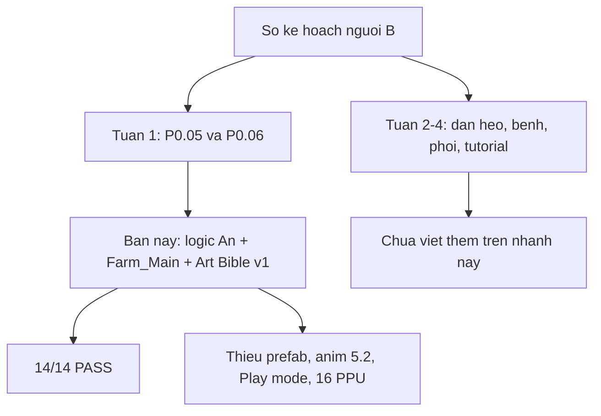

# Tiến độ người B — bản để review

Ngày đo: **2026-10-08**. Nhánh: `feat/B/P0.06-an-farm-main`. Mốc code logic: `d354b03`. File này mô tả đúng những gì đang có trong nhánh, gồm cả việc chưa xong.

Cách đọc: nhìn bảng trạng thái, rồi mở đúng file hoặc đúng tên test ở cột bằng chứng. Không cần đọc lại lịch sử chat.

## 1. Trạng thái một dòng

| Hạng mục | Kết quả |
|---|---|
| Test core | **22/22 PASS** (chạy lại sau khi thêm logic đàn, bệnh, phối, tutorial) |
| Việc B đã đụng | P0.05 và P0.06 một phần. Logic P0.12–P0.17, P0.19–P0.21, P0.23, P0.29–P0.30 ở tầng Core |
| Việc B chưa đụng | P0.26 sprite, P0.31–P0.32 ghép cuối. Slider Canvas và Play mode chưa có |
| Play mode | **Chưa chạy** |
| Đẩy thẳng vào `danhnee/Pig-tycoon` | Được, sau khi nhận lời mời ghi. Nhánh `feat/B/P0.06-an-farm-main` |



## 2. Cách kiểm lại

```powershell
cd D:\Pig-tycoon
dotnet run --project Tests/PigTycoon.Runner.csproj
```

| Điều kiện | Giá trị |
|---|---|
| SDK | `global.json` ghim `8.0.417`, `rollForward: latestFeature` |
| Engine project | Unity `6000.6.3f1` |
| Editor đang cài trên máy đo | `D:\Unity\Editor\6000.6.2f1` — không mở project bằng bản này |
| Cảnh báo lúc test | Nullable warning có sẵn trong Core. Không có test fail |

## 3. Chuẩn đề ra và chỗ chứng minh

| # | Chuẩn | Giá trị khóa | Bằng chứng | Kết quả |
|---|---|---|---|---|
| 1 | Người chơi map B là An | STR 17, AGI 23, CTRL 24, RES 18, id `player.an` | `Assets/Scripts/Core/PlayerRoster.cs`, test `TestPlayerRoster` | Đạt trên test |
| 2 | Khoa vẫn tồn tại, không bị ghi đè chỉ số | STR 24, AGI 18, CTRL 18, RES 22 | cùng test | Đạt trên test |
| 3 | Trang bị không sửa thân | thưởng STR +5, gốc An vẫn 17 | cùng test | Đạt trên test |
| 4 | Bốn hướng | Đông Tây Nam Bắc; đứng yên giữ hướng; Tây lật sprite | `CardinalFacing.cs`, test `TestAnLocomotion` | Đạt trên test |
| 5 | Đi bộ | 4,5 m/s, thể lực và tải ngày không đổi | `PlayerLocomotion.cs`, cùng test | Đạt trên test |
| 6 | Chạy | 7 m/s, hết thể lực thì không chạy | cùng test | Đạt trên test |
| 7 | Hao thể lực lúc chạy | An 1,3/giây; AGI gốc ≥ 30 thì 1,0/giây | cùng test | Đạt trên test |
| 8 | Tải ngày | 20% lượng hao lúc chạy (An: 0,26 mỗi giây chạy) | cùng test | Đạt trên test |
| 9 | Cổng chính | rộng 6,2 m | `FarmMainLayout.MainGateWidthMeters = 6.2f` | Đạt trên hằng số + test `>= 6` |
| 10 | Bốn khu tiếp cận | Bắc, Đông, Nam, Tây theo tọa độ | test `TestFarmMainLayout` | Đạt trên test |
| 11 | Ba khung camera GDD | ngang 40 / 64 / 128 m, cao 22 / 36 / 72 m, ortho = cao/2 | `CameraFrames`, test `TestCameraFrames` | Đạt trên công thức. Scene vẫn ortho khoảng 5,2 |
| 12 | Đồng hồ trong đợt quái | không cộng phút, hết đợt thì chạy tiếp | `GameClock`, test `TestClockPausesDuringCombat` | Đạt trên test |
| 13 | Rào 16 mặt nạ | không đụng công thức nối ô | test `TestFenceGridAutoConnect` vẫn PASS | Giữ nguyên Prototype |
| 14 | Chợ đêm | 8 ô; 1000 ô seed cố định có vàng trong 14%–22% | `TestNightMarketAndMystic`, `TestNightMarketGoldRate` | Đạt trên test |
| 15 | Giá mẫu | 491G và heo non hiếm 410G | `TestEconomyPricing` | Đạt trên test |
| 16 | Point filter cho art mới | Point, không mip, không nén | `Assets/Editor/PixelSpriteImportPostprocessor.cs` | Có code. Chưa reimport toàn bộ PNG trong editor |
| 17 | Palette art mới | 48 màu, file GPL và ASE | `Docs/art-bible/palette.gpl`, `palette.ase` | Có file |
| 18 | Không ép 16 PPU lên art cũ | giữ 32 PPU | `Docs/adr/ADR-0005-prototype-sprite-ppu.md` | Quyết định ghi thành ADR |
| 19 | Tên scene | `Farm_Main`, build settings trỏ scene mới | `ProjectSettings/EditorBuildSettings.asset` | Đổi tên, GUID giữ |
| 20 | Object người chơi | `PF_Player_An` | scene `Farm_Main` | Đổi tên object |

## 4. 14 test đã chạy ngày 2026-10-08

| # | Tên in ra console | Nhóm |
|---|---|---|
| 1 | GameClock: 16-min day, 4 day parts & sleep cooldown | Prototype, vẫn xanh |
| 2 | Farm: Capacity bottleneck & soft density interpolation | Prototype, vẫn xanh |
| 3 | Pig: 4 stages, Hư Thể seal & Xích Mao domestication | Prototype, vẫn xanh |
| 4 | HerdManager: 7 conditions & 3 consecutive days for Sơ Khai | Prototype, vẫn xanh |
| 5 | Economy: Official pricing formula matching GDD v6.0 section 4.5 | Prototype, vẫn xanh |
| 6 | Economy: Night market 18% gold slots & Bí nhân 0% gold | Prototype, vẫn xanh |
| 7 | Defense: Building Hall requirement & Bạch Vân manual trigger | Prototype, vẫn xanh |
| 8 | Grid & Modular Fence: 16-way neighbor bitmask & auto-connection logic | Prototype, vẫn xanh |
| 9 | Roster: chỉ An và Khoa, chỉ số GDD 8.1, thưởng không sửa gốc | Thêm ở bản B |
| 10 | An: 4 hướng và đi bộ không hao thể lực, chạy 7 m/s hao GDD 9.2 | Thêm ở bản B |
| 11 | Farm_Main: ranh giới, cổng >= 6 m, 4 khu hướng | Thêm ở bản B |
| 12 | Camera: 3 khung GDD 3.6 đổi ra ortho size | Thêm ở bản B |
| 13 | GameClock: đồng hồ dừng khi đang đợt quái | Thêm ở bản B |
| 14 | Economy: 1000 ô chợ đêm nhận vàng xấp xỉ 18% | Thêm ở bản B |

Dòng tổng sau bản logic đàn: `KẾT QUẢ: 22/22 tests passed`. Tám test thêm: sức vác, một ngày của An, hàng rào theo trục, thoát cổng, đói-ăn-ngủ, bệnh, phối, tutorial.

## 5. File mới hoặc đụng tới so với `a15aa0c`

| File | Vai trò để review |
|---|---|
| `Assets/Scripts/Core/PlayerRoster.cs` | An và Khoa |
| `Assets/Scripts/Core/PlayerLocomotion.cs` | Đi, chạy, thể lực, tải ngày |
| `Assets/Scripts/Core/CardinalFacing.cs` | 4 hướng và lật Tây |
| `Assets/Scripts/Core/FarmMainLayout.cs` | Biên map, cổng 6,2 m, 4 khu, 3 khung camera, thứ tự sorting layer |
| `Assets/Scripts/Core/GameClock.cs` | Dừng phút trong đợt quái |
| `Assets/Scripts/Core/Character.cs` | Nối chỉ số với roster |
| `Assets/Scripts/Controllers/PlayerMobileController.cs` | Gọi locomotion, Shift hoặc nút Dev để chạy |
| `Assets/Scripts/Controllers/CharacterSpriteAnimator.cs` | Hướng sprite |
| `Assets/Scenes/Farm_Main.unity` | Scene chơi, object `PF_Player_An` |
| `Assets/Editor/PixelSpriteImportPostprocessor.cs` | Point, không mip, không nén |
| `Docs/art-bible/ART-BIBLE.md` | Luật art bản 1 |
| `Docs/art-bible/palette.gpl` và `palette.ase` | 48 màu |
| `Docs/adr/ADR-0005-prototype-sprite-ppu.md` | Vì sao chưa nhảy sang 16 PPU |
| `Docs/agent/tasks/P0.06-an-farm-main.md` | Đầu ra và phần chưa đạt của checkpoint |
| `Tests/Program.cs` | 6 test mới, 8 test cũ |
| `global.json` | Ghim SDK 8 |

Những file Prototype không nằm trong bảng này được giữ. Rào 16 hướng, giá, phòng thủ, vòng đời heo vẫn qua test cũ.

## 6. Sổ việc người B

Ký hiệu: **Đạt test** = có assert xanh. **Một phần** = có sản phẩm nhưng thiếu mục nghiệm thu. **Chưa** = nhánh này không thêm code cho mục đó. **Không chạy** = chưa có bằng chứng editor.

| Mã | Tuần kế hoạch | Việc | Bản này |
|---|---|---|---|
| P0.05 | 05–11/10 | Art Bible, palette 48, luật hướng, lọc point, đặt tên | Một phần |
| P0.06 | 05–11/10 | Prefab map + An idle/walk 4 hướng, prototype bấm chạy | Một phần. Logic và scene có. Prefab riêng, anim 5.2, Play mode chưa có |
| P0.12 | 12–18/10 | Chỉ số An, chạy, thể lực, vác | Đạt test. Trần vác = 15 + STR gốc. An 32 kg. Trên 35 kg là vác nặng |
| P0.13 | 12–18/10 | Thanh Health / Comfort / Happiness và tooltip | Đạt ở dữ liệu `CareBars`. Chưa có slider trên màn hình |
| P0.14 | 12–18/10 | Đói thì ăn hoặc đi tìm, ô ngủ | Đạt test `HerdTick`. Chưa nối vào `PigAgentView` trên scene |
| P0.15 | 12–18/10 | Hàng rào theo hướng tường | Đạt test `FenceCourse`. Rào 16 hướng cũ vẫn xanh. Chưa có nút bấm trong scene |
| P0.16 | 12–18/10 | Cổng 4 hướng 6,2 m và heo vượt rào | Đạt test. Hoảng + khe ≥ 6,2 m thì ra. Khe 2 m thì ở lại |
| P0.17 | 12–18/10 | Một ngày của An, không chết | Đạt test. Mốc giờ nằm trên `GameClock`, không đổi chỉ số ngày |
| P0.19 | 19/10–01/11 | State machine heo | Đạt các trạng thái Wander, SeekFood, Eat, Sleep, Panic, Isolated, Dead |
| P0.20 | 19/10–01/11 | Cách ly, tiêm, 3 thuốc | Đạt test. Cách ly 4 chỗ. Thuốc sai hoặc Hư Mạch thì không khỏi |
| P0.21 | 19/10–01/11 | Bệnh, thời tiết, cảnh báo | Đạt test theo GDD 6.4: 9 bệnh cá thể + Chuồng Nhiễm. Sổ tay ghi 8; code theo bảng GDD trong repo |
| P0.23 | 19/10–01/11 | Phối, lứa, gen | Đạt test GDD 4.4. Mất lứa khi nái chết hoặc tinh thần dưới 20. Chưa có anim |
| P0.26 | 19/10–01/11 | Sprite từ team art | Chưa. 107 PNG Prototype giữ nguyên |
| P0.29 | 19/10–01/11 | Tutorial bước 1–4 | Đạt điều kiện thứ tự. Chưa có UI dẫn chuyện |
| P0.30 | 19/10–01/11 | Tutorial bước 5–8 và chợ | Đạt điều kiện. Bước 8 là nhịp nhìn chợ |
| P0.31 / P0.32 | cuối kỳ | Ghép với người A | Chưa tới |

## 7. Việc cố ý chưa làm

| Việc | Lý do ghi trong repo |
|---|---|
| Ép 107 PNG về 48 màu | Art Bible: ép màu khi chưa xem trong Unity sẽ đổi map đang chơi |
| Đổi art sang 16 PPU | ADR-0005: 16 PPU trên sprite 32 px kéo ô 1 m thành 2 m và phá rào vừa khóa |
| Phóng chuồng lên 120×90 m | Layout đang chơi là thảo nguyên 90×64 m, chuồng 40×28 m |
| Bật sorting layer Ground/Decor/Actors/Canopy/UI_World lên renderer | Y-sort đang dùng `sortingOrder` chung. Tách layer lúc này làm cây và người hết che nhau |
| Mở Unity Play | Editor cài sẵn lệch một bản build so với `ProjectVersion.txt` |
| Font pixel có dấu tiếng Việt | Repo chưa có file font đó |

## 8. Quyền đẩy GitHub

Đo bằng `gh api repos/danhnee/Pig-tycoon`:

| Trường | Giá trị |
|---|---|
| Repo | public |
| Nhánh mặc định trên GitHub | `main` (commit khởi tạo, không chung lịch sử với Prototype) |
| Nhánh game | `Prototype` |
| Tài khoản đang đăng nhập | `Kpoiut` |
| Quyền | `pull: true`, `push: false`, `admin: false` |

Lời mời cộng tác `Kpoiut` vào `danhnee/Pig-tycoon` (quyền write, id `336788101`) đã được nhận trong ngày 2026-10-08. Trước khi nhận, API vẫn trả `push: false` dù GitHub đã hiện là được thêm.

Sau khi nhận, `permissions.push = true`. `git push origin feat/B/P0.06-an-farm-main` tạo được nhánh trên upstream. Pull request cũ: https://github.com/danhnee/Pig-tycoon/pull/1 , base `Prototype`. `main` trên upstream vẫn là commit khởi tạo, không chung lịch sử với game.
