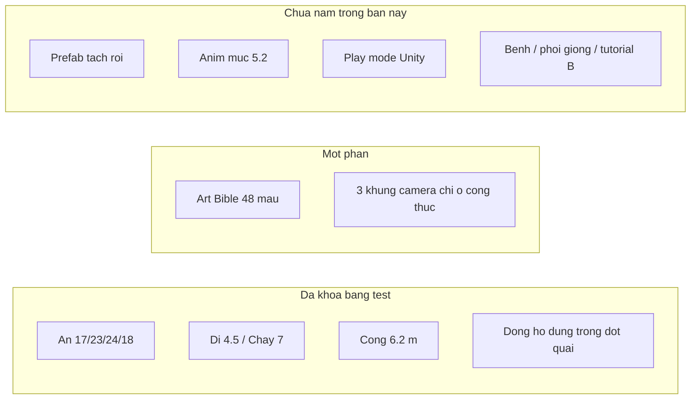

# PIG TYCOON

> Bản để review: nhánh `feat/B/P0.06-an-farm-main` · vai **B** (map, An, art) · đo ngày **2026-10-08**
>
> Bảng nhiệm vụ, chuẩn và bằng chứng: [`Docs/TIEN_DO_NGUOI_B.md`](Docs/TIEN_DO_NGUOI_B.md)

## Xem bản này trong 1 phút

| Việc | Kết quả | Chỗ mở ra kiểm |
|---|---|---|
| Test core | **22/22 PASS** | `dotnet run --project Tests/PigTycoon.Runner.csproj` (chạy trong thư mục repo) |
| Scene chơi | `Assets/Scenes/Farm_Main.unity` | Đổi tên từ `MainFarm2D`, GUID scene giữ nguyên |
| Người chơi | An, 4 hướng, đi 4,5 m/s, chạy 7 m/s | `Tests/Program.cs` → `TestPlayerRoster`, `TestAnLocomotion` |
| Play trong Unity `6000.6.3f1` | **Chưa chạy** | Project khóa editor đó. Máy này có `6000.6.2f1`, không mở project để tránh ghi đè `ProjectSettings` |
| Đẩy vào `danhnee/Pig-tycoon` | Nhánh `feat/B/P0.06-an-farm-main` đã có trên origin | Lời mời ghi phải được nhận thì `permissions.push` mới thành `true` |



## Chuẩn đã khóa bằng test

| Chuẩn | Giá trị trong code | Test chứng minh |
|---|---|---|
| An STR / AGI / CTRL / RES | 17 / 23 / 24 / 18 | `TestPlayerRoster` |
| Khoa STR / AGI / CTRL / RES | 24 / 18 / 18 / 22 | `TestPlayerRoster` |
| Trang bị | cộng vào thưởng, không sửa chỉ số gốc | `TestPlayerRoster` |
| Đi bộ | 4,5 m/s, thể lực không đổi | `TestAnLocomotion` |
| Chạy | 7 m/s; An tốn 1,3/giây; 20% thành tải ngày | `TestAnLocomotion` |
| AGI gốc từ 30 trở lên | chạy tốn 1,0/giây | `TestAnLocomotion` |
| Hướng nhìn | Đông, Tây, Nam, Bắc; Tây lật sprite ngang | `TestAnLocomotion` |
| Cổng chính | 6,2 m | `FarmMainLayout.MainGateWidthMeters`, `TestFarmMainLayout` |
| Bốn khu | Bắc, Đông, Nam, Tây | `TestFarmMainLayout` |
| Ba khung camera | 40×22, 64×36, 128×72 mét | `TestCameraFrames` |
| Đồng hồ lúc đợt quái | không cộng phút | `TestClockPausesDuringCombat` |
| Rào 16 hướng | giữ khớp từ Prototype | `TestFenceGridAutoConnect` |
| Ô chợ đêm có vàng | 1000 ô, tỉ lệ trong khoảng 14%–22% | `TestNightMarketGoldRate` |
| Giá heo mẫu GDD 4.5 | 491G và heo non 410G | `TestEconomyPricing` |
| Palette cho art mới | 48 màu | `Docs/art-bible/palette.gpl` |
| PPU art đang có | giữ 32, không ép 16 | `Docs/adr/ADR-0005-prototype-sprite-ppu.md` |

## Việc của người B trên nhánh này

| Mã | Nội dung kế hoạch | Trạng thái bản này |
|---|---|---|
| P0.05 | Art Bible, palette, point filter, quy tắc đặt tên | Một phần. Có palette, importer, ADR. Chưa font pixel tiếng Việt, chưa 16 PPU, chưa ép lại 107 PNG. |
| P0.06 | Map heo thả và An đi/chạy 4 hướng | Một phần. Scene, chỉ số, hướng, tốc độ, cổng, test. Chưa file prefab riêng, chưa bộ anim mục 5.2, chưa bấm Play. |
| P0.12 | Thể lực, chạy, tải mang | Đi/chạy/tải ngày và sức vác theo STR gốc. An tối đa 32 kg. Trên 35 kg là vác nặng. |
| P0.13 | Ba thanh Health / Comfort / Happiness | Có số và tooltip trong `CareBars`. Chưa gắn slider trên Canvas. |
| P0.14 | Đói, ăn, đi tìm, ô ngủ | `HerdTick`: máng trống thì đi tìm; hoảng và cách ly không ăn máng đàn; một ô ngủ một heo. |
| P0.15 | Hàng rào theo trục tường | `FenceCourse.PlaceRun` giữ mặt nạ ngang hoặc dọc. |
| P0.16 | Bốn cổng và heo thoát | Khe từ 6,2 m và đang hoảng thì ra. Khe 2 m hoặc heo bình tĩnh thì ở lại. |
| P0.17 | Một ngày của An | 06:00 cho ăn, 21:00 ngủ. Kịch bản không trừ máu. |
| P0.19–P0.21 | Trạng thái, bệnh, thuốc, thời tiết | Chín bệnh GDD 6.4, Chuồng Nhiễm, cách ly 4 chỗ, ba thuốc, vắc-xin, cảnh báo. |
| P0.23 | Phối, lứa, gen | Cửa sổ GDD 4.4. Nái chết hoặc tinh thần dưới 20 thì mất lứa. |
| P0.29–P0.30 | Tutorial 8 bước | Đếm theo thứ tự. Nhảy cóc không tính. |
| P0.26, P0.31, P0.32 | Sprite art, ghép cuối kỳ | Chưa. Play mode Unity vẫn chưa chạy. |

Lệnh review:

```powershell
cd D:\Pig-tycoon
dotnet run --project Tests/PigTycoon.Runner.csproj
```

`global.json` ghim SDK `8.0.417`. Lần đo 2026-10-08: **14/14 PASS**, có warning nullable cũ, không có test fail.

Phần bên dưới là mô tả kỹ thuật Universal 2D của Prototype. Số liệu test trong mục 3 đã cập nhật theo lần đo này.

---

# PIG TYCOON - UNITY UNIVERSAL 2D (ANDROID MOBILE)

Dự án **Pig Tycoon** phiên bản **Universal 2D (URP 2D)** chạy trên **Android Mobile**, xây dựng theo chuẩn kiến trúc sạch (Clean Architecture) dựa trên tài liệu **GDD v6.0**.

---

## 1. Điểm đặc trưng của phiên bản Universal 2D (URP 2D)

1. **Góc nhìn Top-down 2D & Xếp lớp chiều sâu (Y-Sorting)**:
   - Sử dụng `SpriteRenderer` kết hợp sắp xếp độ sâu động theo trục Y:
     `SpriteRenderer.sortingOrder = Mathf.RoundToInt(-transform.position.y * 100);`
   - Nhân vật, đàn heo và công trình đứng ở dưới màn hình sẽ tự động che phủ tự nhiên các đối tượng đứng phía sau.

2. **Hệ thống Chiếu sáng 2D (Light2D) theo 4 Buổi trong ngày**:
   - Tích hợp [`DayNight2DController.cs`](file:///home/danh/.gemini/antigravity/scratch/pig-tycoon-unity/Assets/Scripts/Controllers/DayNight2DController.cs) điều khiển **Global Light 2D**:
     - **Sáng (06:00 - 10:00)**: Ánh bình minh dịu ấm (Dawn Color).
     - **Trưa (10:00 - 14:00)**: Nắng trắng chói chang (Noon Color, cường độ 1.15).
     - **Chiều (14:00 - 18:00)**: Ánh hoàng hôn vàng cam (Dusk Color).
     - **Tối (18:00 - 06:00)**: Màn đêm xanh thẫm huyền bí (Night Color, cường độ 0.35, giảm 15% tầm nhìn).
   - **Đèn Lồng Xanh của Bí Nhân**: Khi Bí nhân xuất hiện trong 2 giờ đêm sát ranh giới trại, `Point Light 2D` màu xanh lục sẽ tự động phát sáng báo hiệu!
   - **Đèn Pha Công Nghiệp (Loại 2)**: Chiếu luồng sáng hình nón 25m trong đêm để phá tàng hình và xóa phạt tầm nhìn.

3. **Vật lý 2D Top-down & Điều khiển cảm ứng Mobile**:
   - Sử dụng `Rigidbody2D` (gravityScale = 0) kết hợp `MobileJoystick` (Virtual Joystick màn hình ngang).
   - Di chuyển mượt mà trên mặt phẳng $XY$, tự động lật `SpriteRenderer.flipX` theo hướng trái/phải.
   - Quản lý tiêu hao Stamina khi chạy (1.3 STA/giây theo GDD mục 9.2).

4. **Tối ưu hóa Bầy Đàn (100–200 con heo trên thiết bị Android)**:
   - Script [`PigAgentView.cs`](file:///home/danh/.gemini/antigravity/scratch/pig-tycoon-unity/Assets/Scripts/Controllers/PigAgentView.cs) tối ưu hóa khoảng cách (LOD Culling): các con heo cách xa camera ($> 35\text{ m}$) sẽ bỏ qua tính toán chi tiết, đảm bảo máy Android không bị tụt FPS hay nóng pin.

---

## 2. Cấu trúc thư mục

```
pig-tycoon-unity/
├── Packages/
│   └── manifest.json          # URP (2D Renderer), TextMeshPro, uGUI, Input System, Burst
├── Assets/
│   ├── Scripts/
│   │   ├── Core/              # PURE C# DOMAIN LAYER (Không phụ thuộc UnityEngine)
│   │   │   ├── PigTycoon.Core.asmdef   (noEngineReferences: true)
│   │   │   ├── PigTycoon.Core.csproj   (Target: netstandard2.1 / C# 9.0)
│   │   │   ├── Enums.cs                (12 dòng gen, 10 thời tiết, 4 buổi, chợ, bầy đàn)
│   │   │   ├── GameClock.cs            (16 phút/ngày, 4 buổi, ngủ 6h cooldown, chu kỳ)
│   │   │   ├── Farm.cs                 (Sức chứa gốc/hiệu dụng, nội suy mật độ 0.85 -> 2.20, SC, ÁLSK)
│   │   │   ├── Pig.cs                  (Vòng đời 4 giai đoạn, phong ấn Hư Thể, thuần Xích Mao, Neo Tinh Thần)
│   │   │   ├── HerdManager.cs          (7 điều kiện Bầy Đàn, Alpha Leader, Kế Vị, Truyền Thừa)
│   │   │   ├── EconomyManager.cs       (Công thức giá mục 4.5, Chợ đêm trao đổi + 18% ô vàng, Bí nhân)
│   │   │   ├── DefenseManager.cs       (Phòng Xây Dựng 1-3, nạp đạn trước, kích hoạt Bạch Vân thủ công)
│   │   │   ├── Character.cs            (Chỉ số gốc/thưởng, 6 ô trang bị / 3 cặp võ kỹ, Stamina 2 lớp)
│   │   │   └── GameEngine.cs           (Bộ điều phối trung tâm)
│   │   ├── Input/
│   │   │   └── MobileJoystick.cs       # Virtual Joystick cảm ứng đa điểm 2D
│   │   ├── Controllers/
│   │   │   ├── MobileGameController.cs # Quản lý vòng lặp Tick & Auto-Save Android
│   │   │   ├── PlayerMobileController.cs # Di chuyển Top-down 2D, lật sprite, tiêu hao Stamina, 3 ô võ kỹ
│   │   │   ├── PigAgentView.cs         # AI di chuyển bầy đàn 2D, bám thủ lĩnh, LOD culling
│   │   │   ├── DayNight2DController.cs # Hiệu ứng ánh sáng Light2D URP 4 buổi & đèn lồng Bí nhân
│   │   │   └── DefenseTower2DView.cs   # Tháp thủ 2D tự động xoay và bắn quái
│   │   ├── UI/
│   │   │   └── MobileHUDController.cs  # Thanh Top Bar & cụm nút bấm võ kỹ + Bạch Vân
│   │   └── PigTycoon.Presentation.asmdef # Assembly cho Presentation Layer (kèm URP Runtime)
├── Tests/
│   ├── PigTycoon.Runner.csproj         # Test Runner độc lập
│   └── Program.cs                      # Bộ kiểm thử 22/22, đo 2026-10-08
```

---

## 3. Kiểm thử & Chạy dự án

### Chạy Unit Test kiểm tra tính đúng đắn:
```powershell
cd D:\Pig-tycoon
dotnet run --project Tests/PigTycoon.Runner.csproj
```

Kết quả đo 2026-10-08: **22/22 PASS**. Bảng tên từng test nằm ở [`Docs/TIEN_DO_NGUOI_B.md`](Docs/TIEN_DO_NGUOI_B.md).

### Mở trong Unity Editor:
1. Project khóa **Unity 6000.6.3f1** (`ProjectSettings/ProjectVersion.txt`).
2. Nhấn **Add** và chọn thư mục repo. Trên máy đo này editor cài sẵn là `6000.6.2f1`, nên bản này không mở Play mode.
3. Trong **Project Settings -> Graphics / Quality**:
   - Chọn Pipeline Asset: **URP 2D Asset** (Universal Renderer Pipeline với 2D Renderer).
   - Transparency Sort Mode: **Custom Axis (X: 0, Y: 1, Z: 0)** để hỗ trợ Y-sorting tự động hoàn hảo.
4. Trong **Build Settings**:
   - Chuyển Platform sang **Android**.
   - Texture Compression: **ASTC**.
   - Scripting Backend: **IL2CPP**, Target Architectures: **ARM64**.
